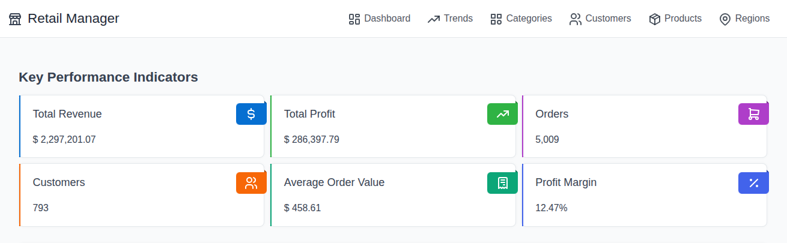
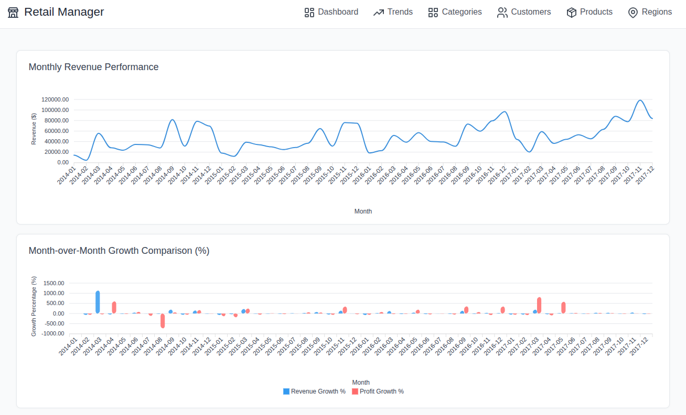
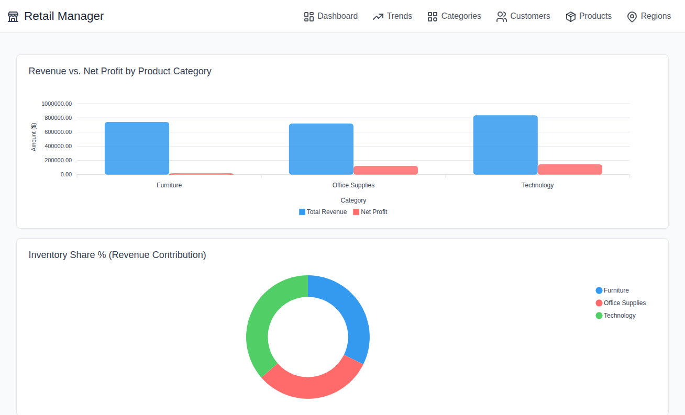
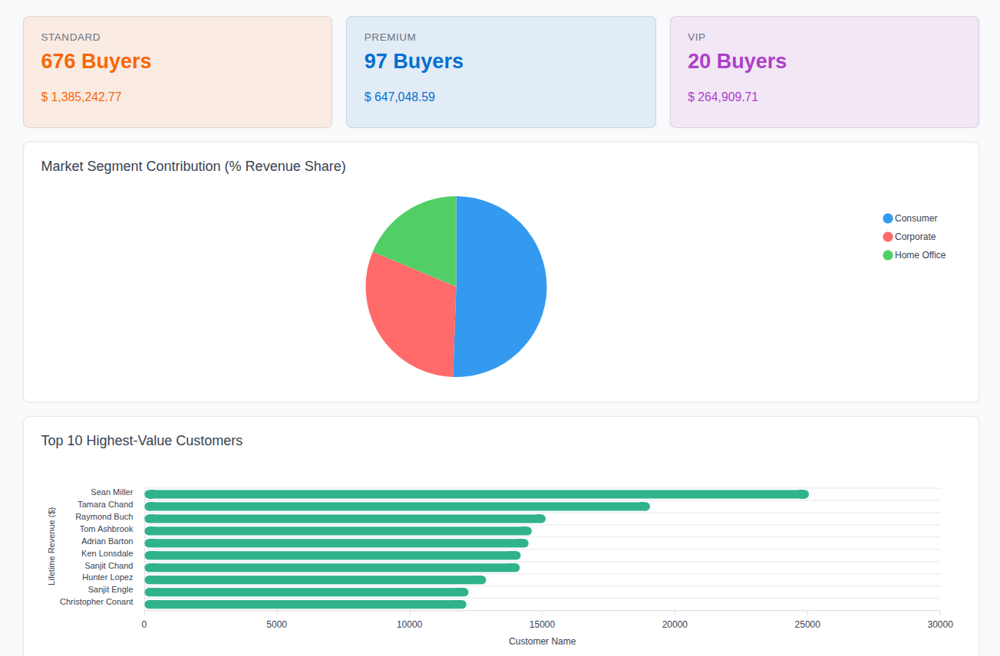
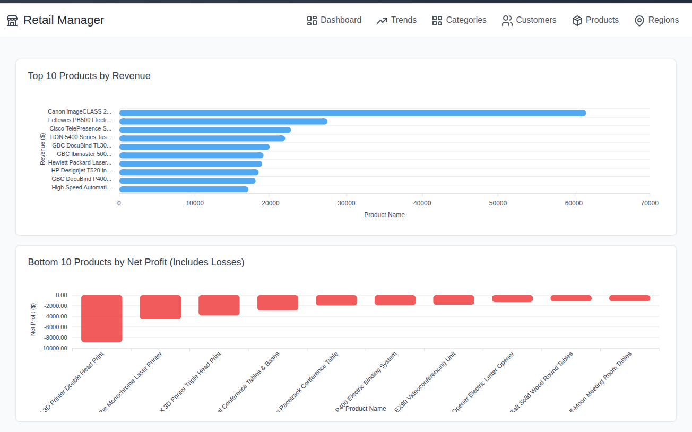
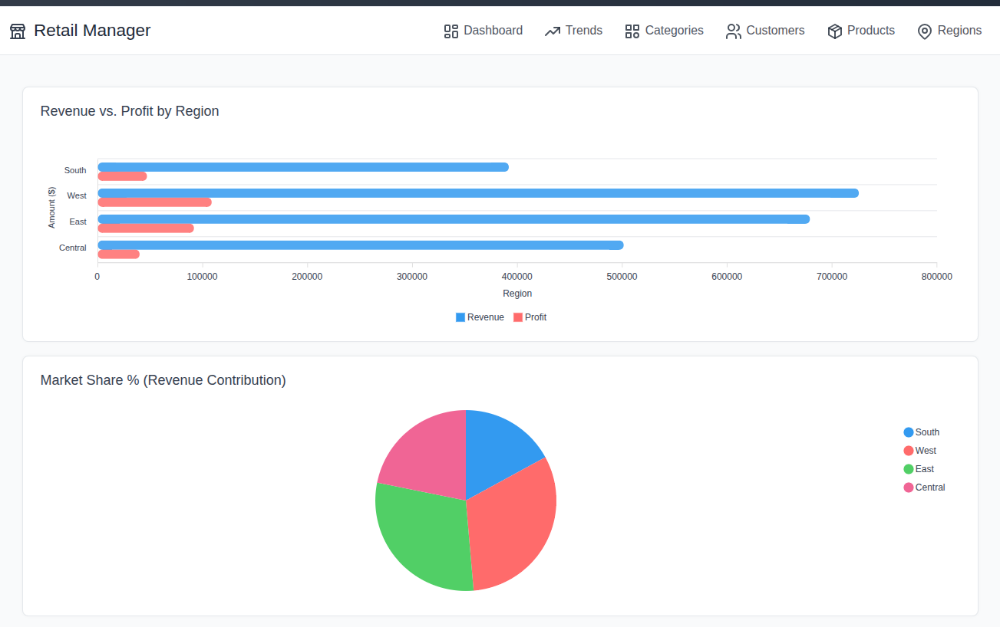

# Retail Sales SQL Analysis

## Overview
This project analyzes the Superstore Sales dataset using PostgreSQL to uncover business insights related to revenue, profitability, customer behavior, product performance, and regional performance.

The primary goal was not simply to write SQL queries but to use SQL as an analytics tool to answer meaningful business questions and provide actionable recommendations.

A strong emphasis was placed on percentage-based analysis because percentages communicate performance more effectively than raw numbers and are easier for stakeholders to understand.

---

## Live Interactive Dashboard
You can explore the interactive charts, KPIs, and metric tables dynamically without setting up a local database:

🔗 **[Launch Live Analytics Dashboard](https://imab50-retail-sales-dashboard.hf.space/index.sql)**

## Interactive Dashboard Previews

### 1. Main Dashboard Overview (`index.sql`)

### 2. Trend Analysis (`trends.sql`)

### 3. Category Performance (`categories.sql`)

### 4. Customer Insights (`customers.sql`)

### 5. Product Insights (`products.sql`)

### 6. Regional Performance (`regions.sql`)

---

## Dataset
**Source:** Superstore Sales Dataset

Key columns used:
* Order Date
* Customer ID / Name
* Segment & Region
* Category & Sub-Category
* Product Name
* Sales, Quantity, Discount, & Profit

---

## Business Questions

### Executive Performance
* What is total revenue?
* What is total profit?
* What is the overall profit margin?
* What is the average order value?

### Category Performance
* Which category generates the most revenue?
* Which category generates the most profit?
* Which category has the highest profit margin?

### Regional Performance
* Which region generates the most revenue?
* Which region has the highest profit margin?

### Customer Insights
* Which customer segment generates the most revenue?
* Which segment places the most orders?
* How much revenue comes from the top customers?

### Product Insights
* What are the top-performing products?
* Which products generate losses?

### Trend Analysis
* Which months underperform?
* How is revenue changing over time?
* How is profit changing over time?

---

## SQL Concepts Used

### Basic SQL
* `SELECT`, `WHERE`, `GROUP BY`, `HAVING`, `ORDER BY`, `LIMIT`

### Aggregations & Logic
* `SUM()`, `COUNT()`, `AVG()`, `ROUND()`, `CASE WHEN`

### Advanced SQL
* **Common Table Expressions (CTEs):** Using `WITH` queries for step-by-step logic segmentation.
* **Window Functions:** `ROW_NUMBER()`, `DENSE_RANK()`, `LAG()`, `SUM() OVER()`, `AVG() OVER()`

### Business Metrics Calculated
* Revenue Share %
* Profit Share %
* Profit Margin %
* Customer Contribution %
* Revenue Growth %
* Profit Growth %

---

## Key Findings
See the comprehensive analytical breakdown and insights in the main report file located here:
📂 **[reports/05_final_insights.md](reports/05_final_insights.md)**

---

## Project Structure
* `assets/` - Dashboard preview screenshots.
* `data/` - Dataset file storage path (`superstore.csv`).
* `sql/` - Data schemas, ingestion layers, sanitization, and analytics scripts.
* `reports/` - Detailed business analytics documentation.
* `dashboard/` - Front-end interactive application scripts (`SQLPage`).

---

## Tools Used
* **Database:** PostgreSQL (Cloud instance via Neon.tech)
* **Application Framework:** SQLPage
* **Hosting Platform:** Hugging Face Spaces
* **Version Control:** Git & GitHub
